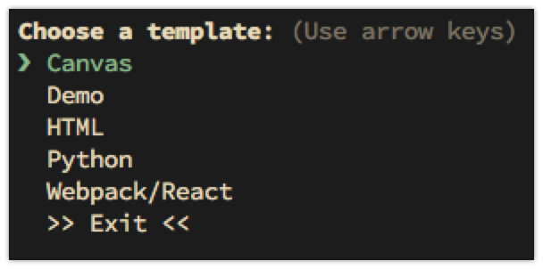
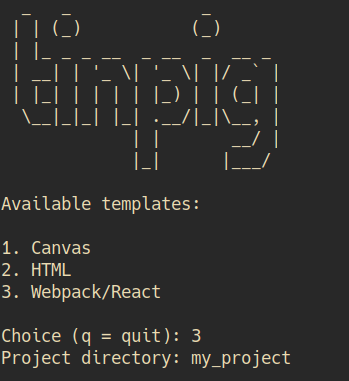

# tinpig Project Creator

tinpig is a simple command line utility for quickly creating projects of any kind. Projects are created from templates which are collections of folders and files. The folders and files can contain special tokens that can be replaced with other values when the project is created. You can use an existing temple as-is, modify a template, or create your own from scratch.

## Requirements

You'll need npm and an updated version of nodejs. Your version of nodejs should be 8.5.0 or higher, for the file copying functionality that was introduced at that point.

## Installation

``` shell
npm install -g tinpig
```

## Use

To create a new project, simply type `tinpig`. This will display a list of available templates for you to choose from.



When you choose a template, tinpig will ask you for a path for your new project. Enter a directory name to create a project with that name in the current directory, or an absolute or relative path to some other location.

If the template includes any replaceable tokens, you will be prompted to provide values for each token. Some tokens may have default values that will be displayed after the name of the token. Press enter to accept the default value, or type an alternate value. Some tokens may be marked as required and others may restrict certain characters to ensure they work correctly as file paths. You'll be notified if your replacement needs correction.



tinpig will then create the project at the specified location, performing all of the token replacment. And you are done, ready to use your new project.

## Command line use

If you know the name of the template you want to use and/or the location at which you want to create your project, you can specify these values on the command line.

``` shell
tinpig --template HTML --path my_project`
```

or, more concisely:

``` shell
tinpig -t HTML -p my_project
```

You can specify one, both, or neither of these values. If you only specify the template you'll be prompted for the path. If you only specify the path, you'll be prompted for a template.

If you specify the path and template, you'll still prompted to enter values for any tokens that may be included in the template.

Also see "External template directories" below for one more command line option.

## Configuration

After you install tinpig, run:

``` shell
tinpig configure
```

This will prompt you for a number of values:

* user name
* user email
* custom templates dir
* invalid path characters

The user name and email values can be used by templates to automatically insert your name or email into a project. Feel free to leave these at their default values. You can always edit them later if a project uses them.

By default, tinpig stores its templates in `~/.config/tinpig/templates/`. Setting a custom templates dir allows you to store the templates in another location of your choice. More on that later in this doc.

tinpig templates can contain dynamic path and file names. If these are marked as paths, tinpig will make sure that the user enters a path name that will not cause problems. The set of invalid path characters listed here are pretty sensible, but you can customize them if you want.

If you ever want to reset the four config values described above, type:

``` shell
tinpig reset
```

This will reset them all to their default values.

All of this data is stored in `~/.config/tinpig/config`. You can edit this file manually as well.

## Existing content

If the project path you specify already holds a single existing file, you cannot create a project there, obviously.

If the project path is an existing directory, you will be warned of this fact. tinpig will never overwrite or alter existing content in a directory. If the template is attempting to create a file that has the same name as an existing file in that directory, that file will silently fail. Any other non-conflicting files should copy over just fine though. You should be aware of what files the template is creating and know if they will conflict with existing content.

## Help

Type `tinpig -h` or `tinpig --help` to see a list of options.

Type `tinpig -l` or `tinpig --list` to see a list of available templates with descriptions.

## Adding new templates

Additional templates will be posted at https://github.com/bit101/tinpig-templates .

Check out or download that repository and copy any templates you want into your local templates directory (`~/.config/tinpig/templates`) or custom templates dir if you set one. Again, feel free to customize them to make them fit your own use.

## Creating new templates

There is a [template creation guide](https://github.com/bit101/tinpig/wiki/Tinpig-Template-Guide) on the wiki page. This details the process and all of the elements that go into making a template.

At its simplest, a template is simply a folder containing some files. But there are other features that can make templates more powerful.

If you create a nice template and want to share, submit it as a pull request at https://github.com/bit101/tinpig-templates .

## Custom template directories

You can choose to store your templates in a directory other than `~/.config/tinpig/templates`. There are two ways to do this.

### Changing the path permanently

Run `tinpig configure` or edit the file `~/.config/tinpig/config` and change the `templatesDir` value to the path you want to store your templates. The next time tinpig starts, it will look there rather than the default location.

Note, if you specify an empty directory, tinpig will copy the default sample templates there the first time it runs.

If you specify a directory that doesn't exist, it will be created and filled with the default sample templates.

### Changing the path temporarily

Use the `-d` or `--directory` parameter on the command line to point to the directory you want to use. e.g.:

``` shell
tinpig -d ~/my_templates
```

You will be asked to choose a template from the ones available in that directory. Note that this directory is only used for this particular run of tinpig. It does not change the values stored in tinpig's configuration.

Note that this method also works if you want to specify a template on the command line. Say `~/my_templates` contains a template named `GoProject`. You could say:

``` shell
tinpig -d ~/my_templates -t GoProject
```

You can also list templates from a custom directory:

``` shell
tinpig -d ~/my_templates -l
```

This will list all the templates in that location.
