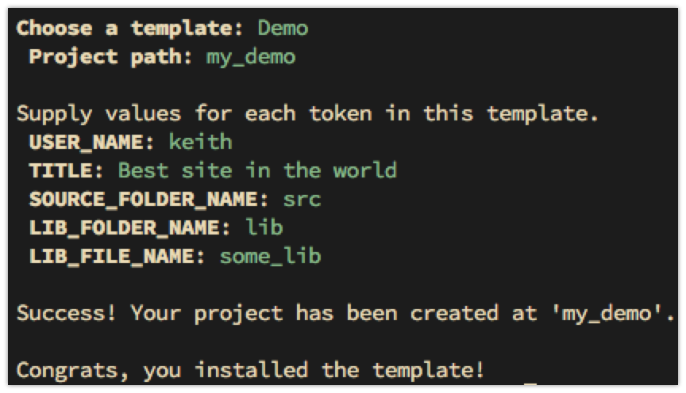

# tinpig Project Creator

tinpig is a simple command line utility for quickly creating projects of any kind. Projects are created from templates which are collections of folders and files. The folders and files can contain special tokens that can be replaced with other values when the project is created. You can use an existing temple as-s, modify a template, or create your own from scratch.

## Installation

``` shell
npm install -g tinpig
```

The first time you run tinpig it will create a folder at `~/.congig/tinpig`. This will contain a file called `config` and a folder called `templates` that holds a few sample templates. Feel free to modify these for your own use, delete them, and add new templates here. If you delete all the folders in this directory, tinpig will repopulate it with the sample templates the next time it runs.

## Use

To create a new project-based template, simply type `tinpig`. This will display a list of available templates for you to choose from.


When you choose a template, tinpig will ask you for a path for your new project. Enter a directory name to create a project with that name in the current directory, or an absolute or relative path to some other location.



If the template includes any replaceable tokens, you will be prompted to provide values for each token. Some tokens may have default values that will be displayed in parentheses after the name of the token. Press enter to accept the default value, or type an alternate value.


tinpig will then create the project at the specified location, performing all of the token replacment. And you are done, ready to use your new project.

## "Advanced" use

If you know the name of the template you want to use and/or the location at which you want to create your project, you can specify these values on the command line.

``` shell
tinpig --template HTML --path my_project`
```

or, more concisely:

``` shell
tinpig -t HTML -p my_project
```

You can specify one, both, or neither of these values. If you only specify the template you'll be prompted for the path. If you only specify the path, you'll be prompted for a template.

If you specify the path and template, you'll still prompted to enter values for any tokens that may be included in the template.

## Help

Type `tinpig -h` or `tinpig --help` to see a list of options.

Type `tinpig -l` or `tinpig --list` to see a list of available templates with descriptions.

## Adding new templates

Additional templates will be posted at https://github.com/bit101/tinpig-templates .

Check out or download that repository and copy any templates you want into your local templates directory (`~/.config/tinpib/templates`). Again, feel free to customize them to make them fit your own use.

## Creating new templates

There is a [template creation guide](https://github.com/bit101/tinpig/wiki/Tinpig-Template-Guide) on the wiki page. This details the process and all of the elements that go into making a template.

At its simplest, a template is simply a folder containing some files. But there are other features that can make templates more powerful.

If you create a nice template and want to share, submit it as a pull request at https://github.com/bit101/tinpig-templates .

